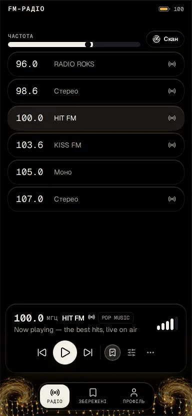
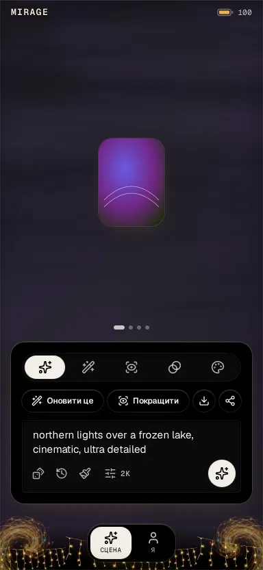
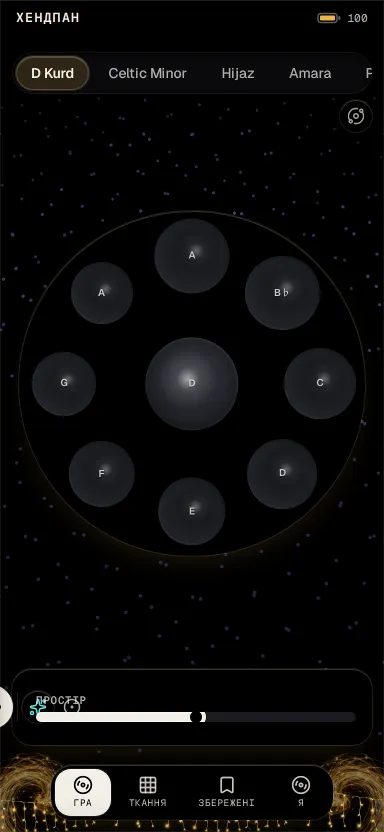

# DreamStudio

**A farm of installable micro-apps, woven from light.**

### **[▶ Open the store](https://dreamstudio.mooo.com/store/)** — add any app to your home screen; they work offline.

 

<table>
<tr>
<td width="33%">
<b>FM Radio</b> · a HackRF One over WebUSB, demodulated on-device
</td>
<td width="33%">
<b>Mirage</b> · make, rework and blend imagery in eleven materials
</td>
<td width="33%">
<b>Handpan</b> · struck tone fields with generated melodic lines
</td>
</tr>
</table>

**76 installable apps** — radio, instruments, astrology, media, games, tools. Dark is the moon's side of the portal, light is the sun's; every screen is drawn with light as the structure.

---

## The architecture — the core and the drivers

Every app here is a **spec + one adapter** on top of two runtime halves: the pinned
[**microspec core**](https://github.com/damanoreshkan-beep/microspec) (the verified `/_rt` runtime, the
schema, the gates — it knows nothing about these apps) and this repo's own **`rt/`** — the domain half:
radio demodulation, astrology mathematics, instrument theory, and the **WebUSB drivers** that talk to real
hardware from a browser tab with nothing installed.

- **`apps/`** — the farm. Each app declares its tabs and cards in `spec.json`, writes one `data.js` /
  `view.js`, and inherits accessibility, responsiveness, offline, i18n and routing from the core.
- **`rt/`** — our runtime modules, served as `/_rt/…` beside the core's; they import the core by bare
  specifier (`@microspec/core/runtime/…`), which every app page's import map resolves. The drivers live
  here: `hackrf.js` (`0x1d50:0x6089`, 256 KiB bulk transfers, RX **and** TX), `rtlsdr.js`, 433 MHz OOK
  capture and replay — each with a research note written before the code.
- **`wasm/`** — the vendored engines (a synthesiser, two game reactors, an offline speech model's runtime),
  built once, committed like codecs.
- **`@microspec/core`** — [the core on JSR](https://jsr.io/@microspec/core), a REAL package pinned to one
  exact version: `deno task install` materializes its full file tree for `/_rt` serving and the build,
  while every tool (the gates, the generators) runs straight off the registry. A framework bump is a
  version move, proven by this repo's own CI before it ships.

## The same gates as the core

Nothing lands by hope: every push runs the browser-free gate DAG, then a real Chromium sweeps every
affected app — axe in both themes, an eight-viewport matrix, the app's own e2e, offline precache, runtime
error surveillance. The built site passes a final measured eye before rsync. **Red stops the change.**

The store itself is one of the apps. Open it, install anything, pull it off your home screen like a native
app — the service worker keeps it alive with the network unplugged.

## The style

The design system is the owner's own visual language — **light as structure**: objects woven from glowing
filaments on true black, one warm amber + one electric cyan, volume told by bloom instead of shadow. The
same contract draws the 76 icons, the store, the chrome and the diagrams on this page. It is enforced, not
documented: an app-authored shadow fails the gate.

### The theme module

The material is this product's, not the core's: **`rt/theme.css`** (`@import "./runtime.css";` first, then
the pair of light, the two palettes, the material's token values, the portal chrome's geometry, the
enclosure, Geist) and its sprites `rt/ds-*.webp` are a module the overlay lays over the core's neutral
`theme.css` by name — in the gate's server and in the build alike — so every page keeps its one
`<link href="/_rt/theme.css">`. The brand's own tests (`rt/tests/theme_test.js`: the true-black page, a rim
on every surface, the poles text-safe in both modes, every hook reaching a sprite that exists) run in the
same `unit` gate as the core's. Another product on the same core brings its own `rt/theme.css`.

Built on <a href="https://github.com/damanoreshkan-beep/microspec">microspec</a> — the appless core this product proves.

