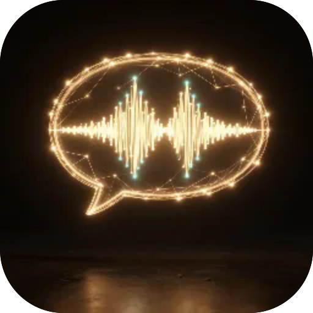

# Голос у текст

**Перетворює голосові з Телеграму на текст. Поділися голосівкою в застосунок — і читай замість слухати. Українська, російська й англійська; усе відбувається на твоєму телефоні, без хмари й акаунта.**

  

---

**Screens** Текст  ·  **Capabilities** —  ·  **Offline** yes  ·  **Installable** yes

Part of the **[microspec farm](../../)** — an AI-authored, gated micro-PWA. Every screen is accessible,
responsive, installable and offline by construction. Browse the whole set from the **[store](../store/)**.

Generated from `spec.json` + `i18n/` by `deploy/readme.mjs` — edit the app, not this file.
