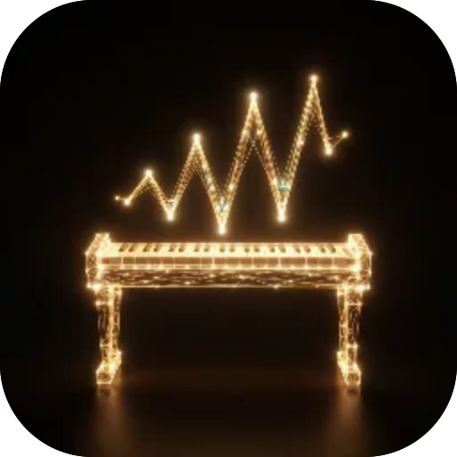
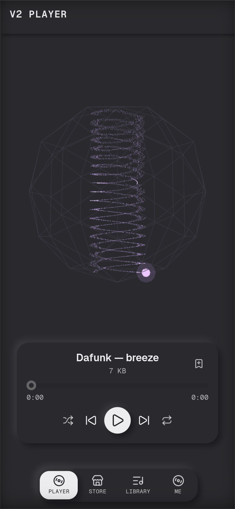

# V2 Плеєр

**Плеєр легендарної музики демосцени. Цілі композиції важать кілька кілобайтів, тож качаються миттєво й лишаються назавжди; грає у фоні, з керуванням на екрані блокування.**

  

 

---

**Screens** Плеєр · Магазин · Бібліотека  ·  **Capabilities** —  ·  **Offline** yes  ·  **Installable** yes

Part of the **[microspec farm](../../)** — an AI-authored, gated micro-PWA. Every screen is accessible,
responsive, installable and offline by construction. Browse the whole set from the **[store](../store/)**.

Generated from `spec.json` + `i18n/` by `deploy/readme.mjs` — edit the app, not this file.
